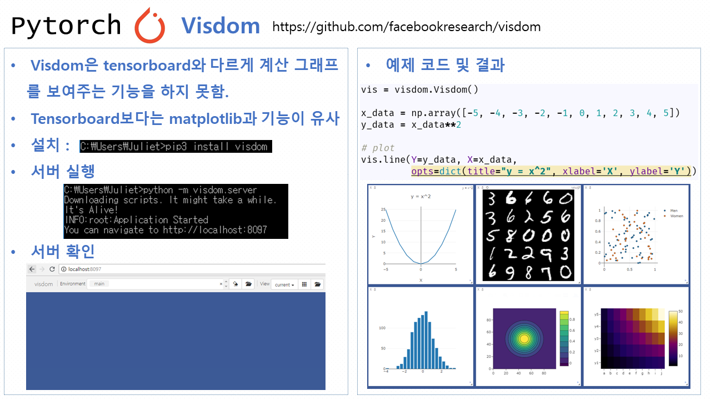

--------------------------------------------------------------------------------
## References
### youtube
- Terry TaeWoong Um, https://www.youtube.com/watch?v=tNWatDufzDk

### book
- Tom Hope, ["Learning Tensorflow: A Guide to Building Deep Learning Systems"](https://www.amazon.com/Learning-TensorFlow-Guide-Building-Systems/dp/9352136101)

### github
- Sunghun Kim, https://github.com/hunkim/PyTorchZeroToAll
- Visdom, https://github.com/facebookresearch/visdom

### site
- Pytorch document, https://pytorch.org/docs/master/index.html
- Visdom real time reference,  https://udacity.github.io/udacidrone/docs/visdom-tutorial.html

### PPT

